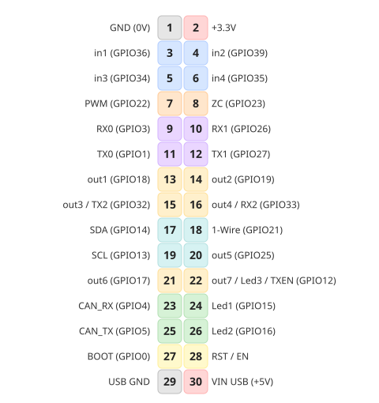
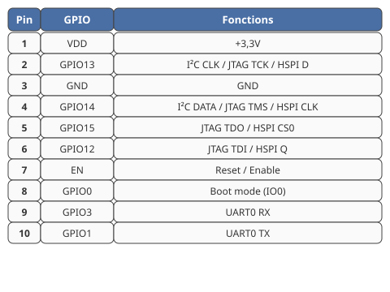
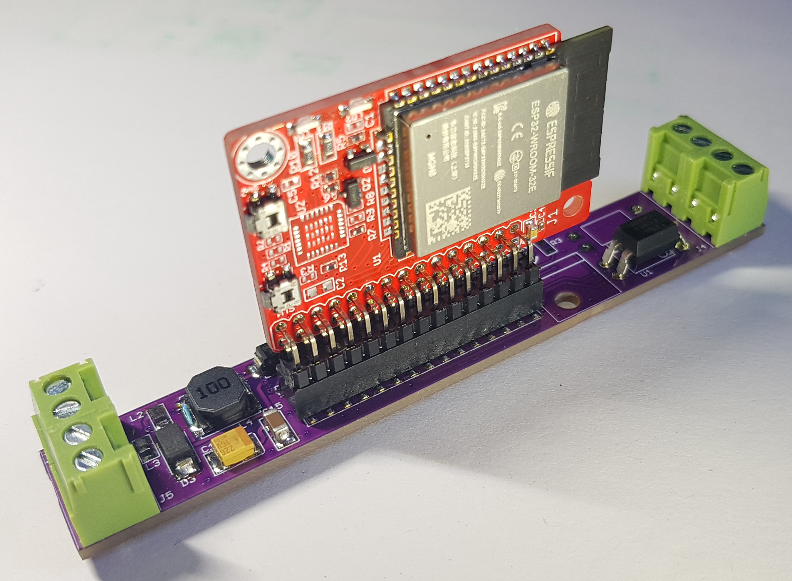
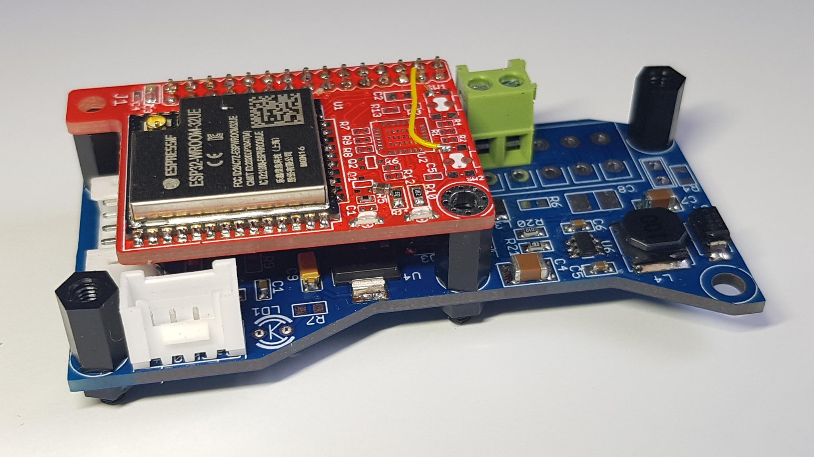
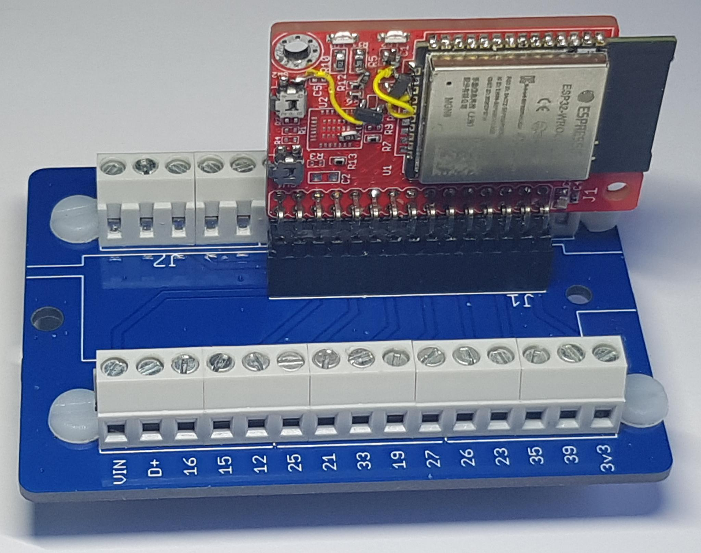
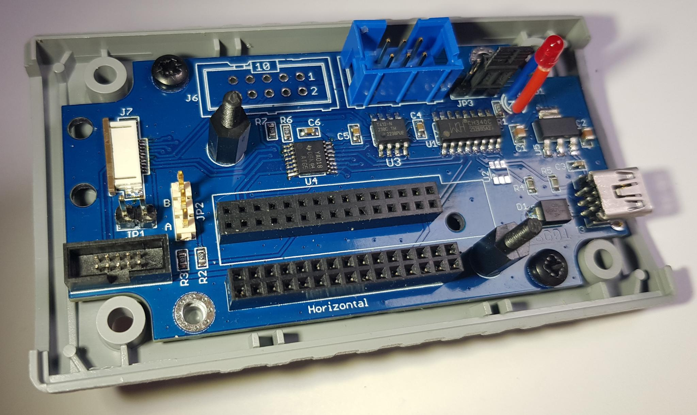

# ESP32-Slimboard-26x40  
Compact ESP32‑WROOM‑32 module (26×40 mm) featuring a 2×15 pin connector for vertical or horizontal mounting, and a 10‑pin ZIF for UART/JTAG programming and I²C/SPI interface.

## 🧩 The Board

The processor board is made arround the ESPRESSIF ESP32‑WROOM‑32UE with 16 MB of flash (or 32E if no external antenna is needed).

USB interface and onboard 3.3V regulator are not provided, an external adapter  [Tools](#-tools) can be used for initial programming. OTA updates can be used afterwards.

The board features a 2×15 pin male connector with 2.0 mm pitch, allowing use on prototyping platforms or production boards.

It has been developed with Eagle Cad version 4.16, but Eagle 6 compatible files (XML format) are provided [here](hardware/), and can be easily imported into KICAD.
## 📐 Specifications
- Small size: 26x40mm
- 2× holes for 2,5mm screews
- Soc module on-board: ESP32‑WROOM‑32‑E (or UE)
  - 240MHz
  - 16MB Flash
  - 520KB Sram
  - 448 KB Rom
- Externally provided 3.3V power supply
- 1× 2×15×2.0 mm male connector
  - Straight version for horizontal mounting
  - Right‑angle version for vertical mounting  
- Reset button    
- 2× indicators
  - red LED on GPIO0  
  - green LED on GPIO2  
- 1× 1x10x0.5mm ZIF connector 
  - for Jtag or Uart programming (ESPPROG2 + adapter recommended)
  - for I²C or SPI expansion
## 🔌 Connectivity
### main connector
Pins have been assigned to application-spécific signals, but all GPIO can be reassigned by software.

### Zif connector

## 🖼 Application examples
<table>
  <tr>
    <td><strong>Linky interface</strong></td>
    <td><strong>Tank level Sensor interface</strong></td>
    <td><strong>Prototyping baseboard</strong></td>
  </tr>
  <tr>
    <td></td>
    <td></td>
    <td></td>
  </tr>
</table>

## 🛠 Tools
|[Uart programming module](https://soldered.com/products/connect-programmer)|[ESPPROG-2 tool](https://docs.espressif.com/projects/esp-dev-kits/en/latest/other/esp-prog-2/user_guide.html)|ZIF programmer|
|:----------------:|:---------------:|:-------------:|
||||

## 📑 Table of Contents
- [Processor Board](#-the-board)
- [documents](documents/)

